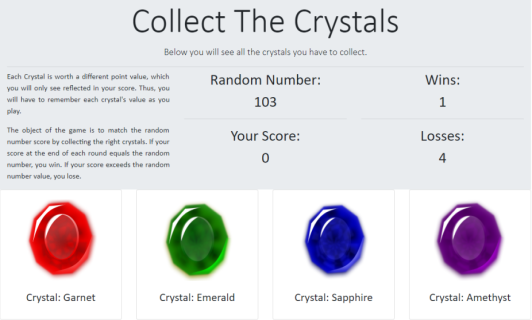

# unit-4-game
This is a simple game where you have to "collect" crystals that each have a random value assigned to them, but these values are not seen by the user, and are only revealed by clicking on a crystal and noticing how much the score value changes. The object of the game is to match the total score, which is displayed on screen and is also randomly generated. 

# screenshot

